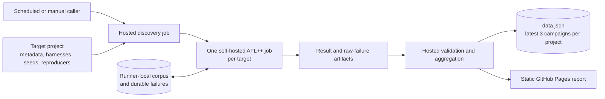

# Consensus Fuzzer

This repository runs finite AFL++ campaigns against fuzz targets published by independent projects.
Each target project owns target behavior, committed seeds, executable construction, and corpus
replay. This repository owns reusable campaign orchestration, project-specific schedules,
runner-local campaign corpora, the result database, and the GitHub Pages report.

The workflow structure is inspired by
[`roc-lang/roc-compiler-fuzz`](https://github.com/roc-lang/roc-compiler-fuzz). The controller is an
independent Zig and GitHub Actions adaptation for project-owned target metadata and a single AFL++
worker per target.

## Why this repository

### Why not OSS-Fuzz today?

The primary blocker is sanitizer support. OSS-Fuzz runs its fuzzing engines in combination with
sanitizer builds. Its
[project contract](https://google.github.io/oss-fuzz/getting-started/new-project-guide/) defaults to
AddressSanitizer and UndefinedBehaviorSanitizer, supports MemorySanitizer, and requires a libFuzzer
build. The sanitizer flags must instrument the project code and link the matching runtime;
instrumenting only C dependencies would leave the Zig code under test uninstrumented. Zig is also
not listed as a first-class OSS-Fuzz language, although OSS-Fuzz notes that other LLVM-based
languages may work. That classification is secondary to the missing sanitizer builds.

Zig 0.16 supports fuzzing coverage through
[`-ffuzz`](https://github.com/ziglang/zig/pull/20725), so coverage-guided fuzzing and libFuzzer
integration are not the missing pieces. It does not provide OSS-Fuzz-compatible ASan, MSan, or
Clang-style UBSan instrumentation for Zig source. The compiler accepts `-fsanitize-c` for C
undefined behavior checks and `-fsanitize-thread`, but rejects the sanitizer modes OSS-Fuzz needs:

```text
$ zig build-exe target.zig -fsanitize=address
error: unrecognized parameter: '-fsanitize=address'

$ zig build-exe target.zig -fsanitize=undefined
error: unrecognized parameter: '-fsanitize=undefined'

$ zig build-exe target.zig -fsanitize=memory
error: unrecognized parameter: '-fsanitize=memory'
```

Zig's ReleaseSafe checks and allocator-aware tests catch important classes of defects, but they do
not produce the sanitizer instrumentation, runtime reports, or reproduction matrix expected by
OSS-Fuzz. Until Zig can build the Lodestar-Z harnesses with those sanitizers, an OSS-Fuzz
integration would miss the main Zig memory-safety boundary it is intended to test. Zig's broader
sanitizer work, including AddressSanitizer and MemorySanitizer, is discussed upstream in
[`ziglang/zig#1199`](https://github.com/ziglang/zig/issues/1199).

[OSS-Fuzz](https://google.github.io/oss-fuzz/) is a mature service and can complement this system
when that blocker is removed. This repository also keeps some project-specific behavior that
remains useful independently:

- The same small metadata contract discovers targets owned by multiple repositories. Harness code,
  seed inputs, input limits, and reproducers remain versioned with the code they test.
- The dedicated runner keeps a project-, target-, and corpus-version-specific AFL++ corpus. The
  workflow controls exactly when a canonical run may replace that corpus, while branch runs can read
  it without publishing over it.
- Campaign artifacts, summary data, and the public report stay in the project's existing GitHub
  workflow. Maintainers can inspect a run without a separate ClusterFuzz or Google Cloud account.

### Why scheduled, finite GitHub Actions campaigns?

Coverage-guided fuzzing benefits from cumulative corpus state, but the fuzzing process does not have
to run forever. Each bounded target job resumes from the canonical corpus, explores for a fixed time,
and publishes a minimized successor only after that target passes fuzzing, minimization, and replay.
The campaign summary is published only after the entire target matrix succeeds. Repeating that
process captures new code, targets, and seeds while keeping CPU use and result boundaries predictable.

GitHub Actions provides the required control plane in the same place as the source repositories:

- scheduled canonical campaigns run the latest controller `main` against the target's canonical ref;
- manual runs can test a branch, tag, or commit without changing canonical history;
- the matrix gives each target an independent job, timeout, log, and artifact;
- concurrency serializes campaigns that share the persistent runner state; and
- hosted aggregation can update `data.json` and Pages without giving the fuzz runner Git write access.

The current Lodestar-Z caller requests a two-hour campaign per target every six hours. GitHub
scheduled workflows may start later than the requested cron time, so the schedule is a periodic
trigger, not a real-time guarantee. A failed or incomplete campaign retains any uploaded diagnostic
artifacts. A failed target cannot publish its candidate corpus. Successful targets in the same matrix
may already have updated their corpora, but an incomplete matrix cannot update the database or Pages.

## Architecture



The hosted jobs form the control plane. They resolve an immutable target revision, validate target
metadata, require one result per discovered target, and decide whether publication is allowed. The
self-hosted matrix is the data plane. It compiles the target project, replays committed seeds, reads
the current persistent corpus, runs AFL++, and preserves failures.

Two publication gates protect canonical state:

1. The controller workflow must run from `lodestar-fuzzer` `main`.
2. The selected target ref must equal that project's configured canonical ref.

Every other combination, including a controller feature branch targeting a project `main`, may read
the canonical corpus but cannot update the corpus, `data.json`, or Pages.

## How a campaign runs

`.github/workflows/fuzz.yml` is the reusable single-project campaign. Small caller workflows provide
the project identity, repository, canonical ref, metadata path, and schedule. The current
`fuzz-lodestar-z.yml` caller starts every six hours and uses Lodestar-Z `main` for 7,200 seconds. Its
manual entry accepts a Lodestar-Z branch, tag, or commit and a per-target duration.

The hosted discovery job checks out the selected project revision once and runs the shared project
contract:

```sh
cd target-project/test/fuzz
zig build fuzz-metadata
```

It validates the configured compact target metadata file, resolves the checkout to an exact
40-character commit SHA, and creates the target matrix. Every campaign job checks out that exact SHA
and runs only:

```sh
zig build -Doptimize=ReleaseSafe -Dfuzz-target="$TARGET"
zig build replay-corpus -Doptimize=ReleaseSafe -Dfuzz-target="$TARGET"
```

Each matrix item starts one finite `afl-fuzz` process in explore mode. The target's published
`max_input_len` is passed through `-G`; AFL++ writes the single-worker state under `default/`.
Campaign jobs upload results but never modify Git.

The final hosted aggregation job requires exactly one artifact for every discovered target. Each
artifact contains `result.json` and every crash or hang retained by AFL++. The Zig merger rejects
missing, duplicate, unexpected, or campaign-mismatched results, retains the latest three complete
campaigns per project in `data.json`, generates `www/index.html`, and performs at most one commit and
push.
Re-running the same GitHub Actions run replaces that campaign. A separate hosted job publishes the
generated site through GitHub Pages.

Aggregation runs only after discovery and every target job complete successfully. A target job may
still preserve and upload failure evidence after corpus post-processing fails, but an incomplete
matrix never updates `data.json` or Pages.

Only a controller `main` campaign targeting the project's canonical ref records `data.json` or
deploys Pages. Non-canonical target refs still aggregate and validate their artifacts, but do not
publish them as canonical history.

In order, a complete campaign:

1. Resolves the requested project ref to an immutable commit and validates its target metadata.
2. Expands that metadata into one matrix item per target.
3. Builds the selected harness and replays its committed bootstrap corpus.
4. Overlays the canonical runner corpus with committed inputs under content-addressed names.
5. Runs one finite AFL++ worker and captures its queue, statistics, crashes, and hangs.
6. For canonical campaigns, minimizes and replays the candidate corpus before atomically publishing
   it. Non-canonical campaigns skip this step.
7. Requires and validates every target result, updates the bounded database, and deploys Pages only
   when both publication gates are satisfied.

## Runner contract

Campaign jobs require these labels:

```text
self-hosted, linux, x64, lodestar-fuzz
```

The host must already provide Zig 0.16.0, LLVM 18, and AFL++ 5.02c. Set the repository variable
`AFL_BIN_DIR` if AFL++ is not installed at `/opt/afl++/5.02c/bin`. The workflow checks versions and
reads `/proc/sys/kernel/core_pattern`; it does not install packages, run `sudo`, or provision the
runner. A piped `core_pattern` fails the preflight.

All agents with the `lodestar-fuzz` label must run on the same physical host and share one
`STATE_ROOT`. Registering that label on another host would split the persistent corpus. Multiple
physical hosts require shared storage or distinct labels that bind each project to one host.

Set the repository variable `STATE_ROOT` to relocate persistent state from
`/var/lib/lodestar-fuzzer`. Each target owns:

```text
$STATE_ROOT/
└── projects/<project>/
    ├── corpus/<target>/v<corpus-version>/
    │   ├── current -> versions/<generation>
    │   └── versions/<generation>/
    ├── failures/<target>/v<corpus-version>/<generation>/
    │   ├── result.json
    │   ├── crashes/
    │   └── hangs/
    └── staging/<target>/v<corpus-version>/<generation>/
```

The project, target, and target-published corpus version form the persistent corpus identity. Only a
controller `main` campaign for that project's canonical ref may update `current`. Other runs may use
`current` as input but cannot publish over it. The job overlays current inputs with
`corpus/<target>-cmin` under SHA-256 content names, so equal inputs deduplicate and unrelated inputs
cannot overwrite each other by basename. It then runs AFL++ and minimizes the new `default/queue`
with `afl-cmin`. A cmin failure stops publication and propagates its original error, leaving the
previous `current` corpus unchanged.
Before publication, every candidate must be a nonempty flat directory of regular inputs within the
target limit and must pass `zig-out/bin/repro-<target>` as a directory replay.

Publication renames the candidate to a new immutable version, creates a `current.next` symlink, and
atomically renames the symlink over `current`. The live version is never changed in place. Cleanup
retains the new current version and its immediate predecessor and only removes resolved paths below
that target's private version and staging directories.

Every AFL crash and hang is copied unchanged. A campaign with failures moves those inputs into the
runner's persistent `failures` directory before result validation, then uploads that directory as the
target artifact. GitHub retains the downloadable artifact for 30 days; the runner copy is the durable
source until failure storage moves to S3. Campaigns without failures leave no persistent failure
directory. The collector enforces AFL++ 5.02c's limits of 25,600 unique crashes and 512 unique hangs
per target run.

Before deploying this workflow, copy or move each existing `$STATE_ROOT/corpus/<target>` directory to
`$STATE_ROOT/projects/lodestar-z/corpus/<target>/v1`. Both layouts may coexist only when the new
target has a `current` symlink, which permits branch validation while the default workflow still uses
the old layout. Remove the old layout after this workflow reaches `main`.

## Adding a project

A project must expose the same bounded contract under `test/fuzz`:

- `zig build fuzz-metadata` writes a validated target matrix.
- `zig build -Dfuzz-target=<name>` builds one `fuzz-<name>` binary.
- `zig build replay-corpus -Dfuzz-target=<name>` replays committed inputs.
- `corpus/<name>-cmin` contains the committed bootstrap corpus.
- `zig-out/bin/repro-<name>` replays a file or flat corpus directory.

Add one small caller workflow that invokes `.github/workflows/fuzz.yml` with a unique `project_id`,
the repository, canonical ref, metadata path, and whether the project needs legacy corpus migration.
Campaigns remain globally serialized on the shared runner, while corpus, failures, artifacts, and
database rows stay isolated by project identity.

The database currently accepts two project identities, matching the planned Lodestar-Z and Zapi
campaigns. Extending that bound requires an explicit configuration change.

Lodestar-Z satisfies this contract through its pending fuzz PR. Zapi does not expose it yet, so its
caller should be added only after Zapi publishes concrete targets and reproducers.

## Pages metrics

The [public report](https://chainsafe.github.io/lodestar-fuzzer/) groups rows by complete campaign.
Its table headers expose these definitions as hover and keyboard-focus tooltips:

| Column | Meaning |
| --- | --- |
| Target | The project-published target name. `corpus vN` is the target's corpus-format namespace, not the campaign number. |
| Failures | AFL++ unique crashes and hangs saved during this target run. The page includes at most one representative base64 sample of each kind; the run artifact and durable runner storage retain every raw failure. |
| Queue | `new` is AFL++ `corpus_found`, the queue entries discovered locally during this run. `at exit` is `corpus_count`, the total queue size when the worker finished. |
| Coverage signal | `edges_found / total_edges`, the reached AFL++ instrumentation-map slots and binary-local map occupancy. It is not source-line or function coverage and is not comparable across different binaries. |
| Work | Total target executions, average executions per second, and target runtime. Campaign target time is summed across parallel jobs, so it is not wall-clock duration. |

The campaign heading links to the GitHub Actions run and exact tested commit. The summary totals the
rows below it. `data.json` retains only the latest three complete campaigns per project, and
re-running the same Actions run replaces its existing campaign rather than adding a duplicate.

## Zig tools

Zig 0.16.0 builds all tools:

```sh
zig build
zig build collect-result -- <project> <repository> <campaign-id> <ref> <sha> <commit-time> \
  <target> <corpus-version> <max-input> <afl-output> <crashes> <hangs> <result.json>
zig build merge-results -- <project> <repository> <campaign-id> <ref> <sha> <commit-time> \
  <targets.json> <artifact-directory> <data.json>
zig build generate-website
```

The versioned result database identifies each campaign by project, repository, and GitHub Actions run.
Each target records its corpus version, run time, execution count, exit queue size, locally discovered
queue entries, the AFL coverage signal, crash and hang counts, and at most one raw sample of each
failure kind.
Each `result.json` is limited to 4 MiB. The database is limited to 32 MiB and updates atomically, so
an oversized result fails without replacing the previous database.

The merger accepts the original flat result array only as a one-time legacy input. The first
campaign-aware update replaces those rows because their campaign membership cannot be recovered
reliably.

[AFL map edges](https://aflplus.plus/docs/afl-fuzz_approach/) are instrumentation slots, not source
line or function coverage. The Pages report shows reached slots, binary-local map occupancy, newly
discovered queue entries, corpus size, execution throughput, duration, and failures.
